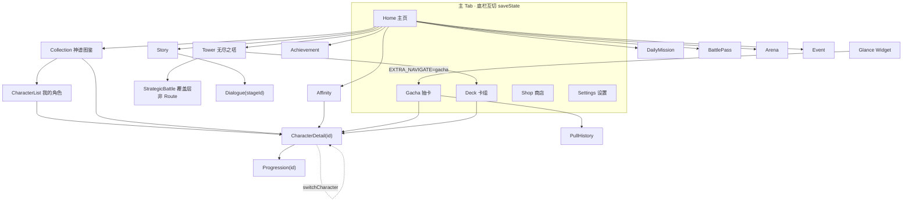
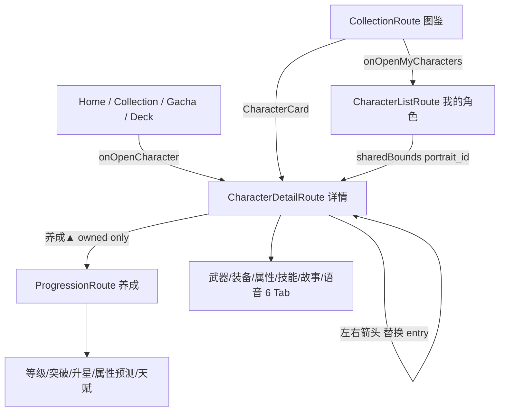

# Milan App 全页面 UI 调研报告

> 研究问题：系统梳理 Milan（Kotlin/Compose）Android 抽卡游戏全部页面的 UI——导航架构、每个 Screen 的布局/交互/视觉、共享组件与设计系统。
>
> 深度：deep · 日期：2026-09-10 · 代码基线：`MilanKotlin/app/src/main/java/com/milan/game/ui/`
>
> 证据以 `file:line` 标注；细节展开见 `research/milan-app-ui/findings/F1–F7.md`。

---

## 1. 执行摘要

Milan 是单 Activity + Navigation Compose 2.9 类型安全路由的 Compose 游戏。**19 个可达目的地**：底部 5 Tab（Home / Gacha / Deck / Shop / Settings）+ 14 个压栈子页（角色链 4 层、活动系统 9 页、抽卡历史、对话关卡）。视觉语言统一为 **「丹青典藏 · Gilded Codex v3」**：玄墨底 + 金箔强调 + 朱砂印章，全 App 稀有度取色只走 `AppTheme.rarityColor`。

- 导航：扁平图、无嵌套 graph；Tab 由各 Screen 内嵌 `GameNavBar`（非 Scaffold bottomBar）；立绘用自建 `LocalSharedTransitionScope` 做 `sharedBounds` 共享元素。
- 反馈：写操作统一 `WriteOutcome` 三态 → VM `Channel` → `LocalFeedback` Snackbar；仅「重置存档」有二次确认 Dialog。
- 最完整体验在 **Gacha**（Charge→Beam→揭晓状态机）；最简陋在 **Arena / 策略战斗**（无结算演出 / 纯文本战术板）。
- 主要债务：死代码组件（BattleReplay、InkBottomSheet、BattleHapticEffect）、Home「查看全部」空 id 错路由、Event 任务进度硬编码 0、详情→养成无共享元素、两套战斗结算 UX 割裂。

---

## 2. 导航架构与完整路由图

### 2.1 结构要点

| 项 | 事实 | 证据 |
|----|------|------|
| 导航库 | Navigation Compose 2.9，`@Serializable` 路由，无字符串路由 / NavType / deepLink | Routes.kt:1-13; MilanNavHost.kt:40-43 |
| 图形态 | 单 `NavHost` 扁平图，`startDestination = HomeRoute` | MilanNavHost.kt:151-160 |
| 底栏 | `GameNavBar` 由 5 个 Tab Screen **各自渲染**；子页无底栏 | HomeScreen.kt:204-208 等 |
| Tab 切换 | `popUpTo(start){saveState}` + `restoreState` + `launchSingleTop` | MilanNavHost.kt:110-117 |
| 返回 | `popBackStack()`；Predictive Back 由 Navigation 自动接入，无手写 BackHandler | Routes.kt:10-11 |
| 共享元素 | `SharedTransitionLayout` 包 NavHost；key=`portrait_{id}`；Deck/Collection/List/Detail 四页 | MilanNavHost.kt:146-150; CharacterCard.kt:73-78 |
| 外部入口 | Glance 小部件 Intent extra `milan.navigate=gacha`（非 URI deep link） | MainActivity.kt:24-40 |
| 角色切换 | `popUpTo(current){inclusive}` 替换 entry，不堆栈 | MilanNavHost.kt:129-138 |
| 启动门控 | `!ready` → InkSkeleton；`failure` → InkErrorScreen；就绪前不组合 NavHost | MilanNavHost.kt:82-106 |

### 2.2 路由清单（19）

**主 Tab（5）**

| Route | Screen | 备注 |
|-------|--------|------|
| `HomeRoute` | HomeScreen | startDestination |
| `GachaRoute` | GachaScreen | 另可从 Home CTA / Glance 进入 |
| `DeckRoute` | DeckScreen | 可从 Tower 跳入 |
| `ShopRoute` | ShopScreen | — |
| `SettingsRoute` | SettingsScreen | — |

**子页（14，压栈盖 Tab）**

| Route | 参数 | Screen | 主入口 |
|-------|------|--------|--------|
| `CollectionRoute` | — | CollectionScreen | Home 图鉴 |
| `CharacterListRoute` | — | CharacterListScreen | Collection「我的角色」 |
| `CharacterDetailRoute` | `characterId: String` | CharacterDetailScreen | 多处角色卡 |
| `ProgressionRoute` | `characterId: String` | ProgressionScreen | Detail「养成」 |
| `TowerRoute` | — | TowerScreen | Home 爬塔 |
| `AchievementRoute` | — | AchievementScreen | Home 成就 |
| `PullHistoryRoute` | — | PullHistoryScreen | Gacha 历史 |
| `StoryRoute` | — | StoryScreen | Home 剧情 |
| `DialogueRoute` | `stageId: String` | DialogueScreen | Story 关卡 |
| `DailyMissionRoute` | — | DailyMissionScreen | Home 日常 |
| `BattlePassRoute` | — | BattlePassScreen | Home 纪行 |
| `AffinityRoute` | — | AffinityScreen | Home 好感 |
| `ArenaRoute` | — | ArenaScreen | Home 竞技 |
| `EventRoute` | — | EventScreen | Home 活动 |

已删除：~~`PvERoute`~~（2026-09-06 S2）。参数类型全部为 `String`，无 nullable、无嵌套 graph。

### 2.3 导航树



转场（InkTransitions）：子页右进左出 200/150ms；Tab 交叉淡入淡出 + 微缩 180ms。

顶栏 `AppTopBar`：48dp 返回热区 + 标题水墨 alpha 呼吸 + 可选 `ResourceBar`（✦星尘/◆钻石）。非全局 Scaffold。

---

## 3. 设计系统（Gilded Codex v3）

App 自我定位：只陈列珍本的典藏馆；卡牌是文物，界面是展陈系统。色彩三层：基底玄墨 / 材质面玻璃 / 强调金箔+朱砂；**禁止第四层氛围色**。

### 3.1 权威色板 `AppTheme`

| Token | Hex | 语义 |
|---|---|---|
| `BgDeepest` | `#0A0D14` | 页面最深底 |
| `BgMid` | `#10141C` | 卡片基底 |
| `Gold` | `#E0B860` | 金箔主 CTA |
| `Frost` | `#68B0A8` | 石青次操作 |
| `SealRed` / `Danger` | `#D04848` | 印章红 / 危险 |
| `Text1/2/3` | `#F2EFE8` / `#B8BCC8` / `#767C90` | 文字层级 |

仅 **darkColorScheme**；默认 `useDynamicColor=false`（保品牌一致）。

**稀有度四档（唯一取色口 `AppTheme.rarityColor`）**

| rarity | 名 | Color |
|---|---|---|
| 1 | R 松烟 | `#C8D0DC` |
| 2 | SR 石青 | `#68B0A8` |
| 3 | SSR 朱砂 | `#D86060` |
| 4 | UR 金箔 | `#F0D060` |

**元素 8 系**（`ElementTheme`）：Metal金 / Wood木 / Water水 / Flame火 / Earth土 / Light光 / Shadow暗 / Thunder电；未知回退 Flame。三世界 `WorldPalette`（Shinwa/Aether/Ironveil）只允许作用于背景氛围层。

### 3.2 字体

- 展示/标题：Noto Serif SC SemiBold + `tnum`（display 40/32/28 · headline 22/20）
- 品牌楷书：`ma_shan_zheng_regular`，仅 `BrandType`「丹青录」与 `RitualType` 抽卡仪式标题两处；禁止伪粗体
- 数值统一 `Format.formatCount` 千分位

### 3.3 核心组件

| 组件 | 用途 |
|---|---|
| `CodexCard` + `CharacterCard` | TCG 实体卡壳（纸厚/工艺框/画心）；UR 流光、SSR 金边呼吸、SR 釉光 |
| `GoldButton` / `NeonButton` | 主/次 CTA；斜切 CutShape 金三段渐变 vs 描边内发光 |
| `GlassPanel` / `PageBackground` | 玄墨玻璃面板与页面三段渐变底 |
| `GlassDialog` | 墨色渐变对话框（唯一二次确认底座） |
| `FormationBar` | 出战槽位条（Deck + Tower 共用） |
| `EmptyState` | 空态（Material outlined icon，禁 emoji） |
| `ResourceBar` | 货币 HUD（✦/◆），订阅 economy 切片，400ms 数值滚动 |
| `LocalFeedback` | 全局 Snackbar 宿主（NavHost 外，底栏上方 84dp） |

### 3.4 特效与动效

- **FluidBackground**（Home）：AGSL RuntimeShader 水墨流体，API 33+，45ms 节流；<33 退渐变
- **抽卡演出族**：CyberCharge / CyberBeam / CyberCards / CyberStage；稀有度驱动粒子数、光柱宽、震屏幅度
- **InkSplash**：按压墨溅（Gold/Neon/快捷 chip）
- **EntranceItem**：列表交错入场（≤8 档 ×40ms）
- **HapticManager**：LIGHT/MEDIUM/HEAVY/RICH 分层；目前主接 Gacha

死代码/未接线：`ParallaxScroll`、`DynamicTheme`、`InkBottomSheet`、`InkSnackbar`、`InkTooltip`、`BattleHapticEffect`、`BattleReplay`、`SingleDamageFloat`。

---

## 4. 主 Tab 页

### 4.1 Home — 丹青典藏馆大厅

- **目的**：首屏展柜大厅；一条主行动 + 快捷入口 + 名录枢纽。
- **布局**：FluidBackground → 品牌条（「丹青录」楷书 + ResourceBar）→ LazyColumn：Hero 展柜（稀有度 Halo 呼吸 + 浮动立绘 + 玻璃铭牌）→ 金 CTA「前往召唤」→ QuickActions 横滑 9 chip → 丹青名录 AvatarStrip（6+查看全部）→ 底注；页内 `GameNavBar`。
- **入口地图**：Hero/头像 → 角色详情；CTA → Gacha tab；9 chips → Collection/Tower/Story/DailyMission/BattlePass/Affinity/Achievement/Arena/Event。
- **浮层**：`CrashDialogIfAny`（上次崩溃现场 GlassDialog）。
- **问题**：名录「查看全部」调 `onOpenCharacter("")` → 落到 `CharacterDetailRoute("")` → `MissingCharacter` 安全态，应改 Collection/List 路由（HomeScreen.kt:471）[1][7]。

### 4.2 Gacha — 丹青寻访

- **目的**：卡池信息 + 全屏揭晓演出 + 结果；可跳过、可分享、可查历史。
- **布局**：多池 chips → GlassPanel（池名/概率/保底条/UP 定轨）→ 角色预览 LazyRow → CyberHerald 待机法阵（pityRatio 脉动）→ 单抽 Neon / 十连 Gold → 摘要/分享/历史 → PullStatsPanel → 结果网格（非 Lazy，chunked(5)）。
- **演出状态机** `RevealStage`：`Charge → Beam → Single|Ten → Done`。
  - Charge：粒子汇聚 300–900ms
  - Beam：光柱上冲 + 火花
  - Single：弹簧翻入 + UR 流光 + 签文
  - Ten：2×5 卡背逐张翻，UR 金箔爆裂
- **可整屏点击 / BackHandler 跳过**（token 作废挂起编排）；Haptic 按最高稀有度分级；`PullShareCard` 导出 1080 PNG。
- **无二次确认**；余额前置校验。

### 4.3 Deck — 卡组

- FormationBar + 2 列 CharacterCard 网格（滚动视差 ±8dp）+ 全屏 `DeckPreviewOverlay`（加入/移出编队、查看详情）。
- 空态 EmptyState 引导去寻访。
- 编队写操作 `toggleFormation` → WriteOutcome → toast；空槽点击 Snackbar 提示去卡片预览加入。

### 4.4 Shop — 商店

- ResourcePanel 四资源（✦/◆/❖/⚔）+ 四类交易：每日特惠 / 碎片包 / 碎片兑换 / 钻石兑换。
- 定价一律 `EconomyFormulas`；**一键直购无确认**；busy 防连点；结果 Snackbar。
- 钻石「暂无获取途径」弱化提示。

### 4.5 Settings — 设置

- 三开关（音效/振动/推送，`GoldSwitch`）+ 重置存档（**唯一 GlassDialog 确认**）+ 崩溃日志导出 + AI 推荐（培养 top3 / 抽卡策略，不可下钻）+ 关于。
- 平台副作用（Audio / Notifier）留 Screen 回调注入，VM 可纯 JVM 测。

---

## 5. 角色链路

### 5.1 用户旅程



### 5.2 CharacterListScreen

- CompletionPanel（收集进度 + 分稀有度徽标）+ ListFilterBar（搜索/稀有度/元素/排序）+ 2 列 CharacterCard 网格。
- 筛选状态 `rememberSaveable`；共享元素 `portrait_{id}`。

### 5.3 CharacterDetailScreen

- Hero = 屏高 56% `SubPageHero`：立绘 + 墨色渐隐 + 稀有度/元素铭牌；未拥有暗遮罩「未获得」。
- 6 Tab：武器（assets/weapons/*.webp IO 解码）· 装备（5 槽穿脱/强化/分解）· 属性（WoW 风格四维+次级）· 技能 · 故事（三段式彩色竖条）· 语音（TTS）。
- 左右切角色替换返回栈 entry；仅 owned 显示「养成」。
- 属性展示口径 **不含装备加成**（`CharacterStats`），与战斗 `ServiceCore.unitStatsFor` 双轨。

### 5.4 ProgressionScreen

- Hero 46% 屏高 + ResourceBar（✦/❖）+ 五面板：
  1. 等级与经验（×1/×5/升满）
  2. 突破（碎片+星尘）
  3. 升星
  4. 属性预测（Lv+1 / 突破 / 升星 青字）
  5. 天赋树（强攻/坚壁/灵动 三分支）
- **无 sharedBounds**（详情→养成立绘硬切）；写操作 busy + Rejected 细分 toast。

### 5.5 CharacterCard（列表/卡组/图鉴共用）

CodexCard 外壳：稀有度章 + 元素徽 + 画心立绘 + 鎏金分隔 + 铭牌；locked 蒙层；footer 可放星级/未获得。

---

## 6. 系统与活动页

| 页面 | 目的 | 关键 UI | 交互/问题 |
|------|------|---------|-----------|
| **Tower** | 爬层终局 | 纪录卡 + FormationBar + 战力预览 + 结算卡；全屏 BattleResultOverlay / StrategicBattleScreen | 自动挑战/复刷/策略可操作；战票不足禁用 |
| **Arena** | PVP | 段位卡 + 对手列表 + 赛季奖励 | **静默结算仅 Snackbar**，无战报演出 |
| **Story** | 章节列表 | 封面立绘章节卡 + StageRow | 锁定章 Snackbar 提示；进度 `remember` 不随完成刷新 |
| **Dialogue** | VN 对话 | 立绘区 + 打字机 + 自动/跳过 + 分支 ChoiceCard + InkSplash 进出 | 说话者/颜色硬编码 4 UR |
| **DailyMission** | 每日委托 | 活跃度 0–100 进度条 + 5 宝箱里程碑 + 任务卡列表 | 领宝箱 toast；跨日重置在 VM |
| **Achievement** | 成就 | 状态三色卡 + 一键领取 | busy 防连点 |
| **Affinity** | 好感 | 说明卡 5 档奖励预览 + 角色进度卡 + 赠送 | 奖励文案为装饰无服务解锁；无确认直送 |
| **BattlePass** | 纪行 | Lv 头 + 免费/豪华双轨奖励行 | 680 钻石直购无确认；exp/1000 写死 |
| **Event** | 限时活动 | 倒计时卡 + 任务行 | **任务进度硬编码 0**；无领取按钮 |
| **Collection** | 全图鉴 | 收集进度头 + 筛选 + 2 列网格（含 locked） | 与 List 数据源分裂（全量 vs owned） |
| **PullHistory** | 抽卡记录 | 统计头 + 最近 100 条 | 无分页/筛选 |

统一页壳：`AppTopBar` + `PageBackground` + GlassPanel/列表 + `EntranceItem`；VM 订阅 snapshot；写操作 LocalFeedback。

---

## 7. 战斗与结算

### 7.1 两种模式

| 模式 | 入口 | UI |
|------|------|-----|
| **自动模拟** | Tower 主 CTA `challengeNext()` / `retryBest()` | 服务层瞬时结算 → `BattleResultOverlay` 全屏（分镜：遮罩→标题弹入→奖励滚动计数→金箔/灰烬粒子→DamageFloatingText→2×3 统计）+ 页内 `TowerResultCard` 可折叠战报 |
| **策略可操作** | Tower `showStrategic=true` 覆盖层（**非 NavRoute**） | `StrategicBattleScreen`：敌上排 / 战报 96dp / 我下排 / 技能条；纯色块 UnitTile（HP 三段色 + 能量条）；选技能→目标→确认；无立绘、无飘字、无自动/加速 |

Arena 挑战：**无战斗过程 UI**，服务层静默 + toast。

### 7.2 死代码与债务

- `BattleReplay`：完整回放组件，零调用；「跳过」无 clickable。
- `BattleHapticEffect` / `SingleDamageFloat`：零调用。
- `TowerService` 策略 API 仍标 `@Deprecated("战略战斗UI零调用")`，但 VM 已在调用——文案过期。
- 两套结算 UX 差距大：自动塔是演出，策略战是 `GlassDialog` 轻量文案。
- 策略战中途退出无确认；门票在 settle 才扣，中途退出语义未在 UI 提示。
- `showStrategic` 非 rememberSaveable，进程死亡丢失。

---

## 8. 覆盖层、反馈与跨屏约定

### 8.1 Home 入口图

| 元素 | 目的地 |
|------|--------|
| Hero 铭牌 / 名录头像 | CharacterDetailRoute |
| 「前往召唤」 | Gacha tab |
| QuickActions ×9 | Collection / Tower / Story / DailyMission / BattlePass / Affinity / Achievement / Arena / Event |
| 「查看全部」 | **误入** CharacterDetailRoute("") |

### 8.2 Dialog / Overlay 清单

**在用**：GlassDialog 底座 → Crash 现场、重置存档确认、策略战斗结算；BattleResultOverlay（塔自动战）；MissingCharacter 安全态；InkErrorScreen 启动失败；Deck 全屏预览；策略战斗全屏层。

**死代码**：InkBottomSheet、InkSnackbar、InkTooltip。

### 8.3 确认范式

- **唯一二次确认**：重置存档。
- 货币消耗（抽卡十连、商店、纪行 680💎、好感送礼、爬塔门票）**全部一键直购**，靠按钮 enabled + 余额预检 + Snackbar。

### 8.4 反馈

```
VM: Channel<String> → receiveAsFlow()
Screen: LaunchedEffect { vm.toasts.collect { feedback.show(it) } }
```

覆盖 Shop/Settings/Story/Achievement/Affinity/Arena/BattlePass/DailyMission/Deck/Progression/CharacterDetail 等。残留系统 Toast 仅 Crash 复制成功一处。

### 8.5 加载 / 空态 / 错误

- App 级：ready 前 InkSkeleton；failure → InkErrorScreen（可重试）。
- 页内无独立 loading 骨架（内容已 Application 预载）。
- 空态统一 EmptyState；角色 id 失配 MissingCharacter。

---

## 9. 关键缺口与债务（汇总）

### 9.1 明确 Bug / 错路由

1. **Home「查看全部」→ `CharacterDetailRoute("")` → MissingCharacter**，应改 Collection 或 CharacterList（HomeScreen.kt:471）[single source: F2/F7 一致]
2. **Event 任务进度硬编码 `"0 / target"`**，未读服务 progress（EventScreen.kt:133）
3. **Story 章节进度 `remember` 不订阅 snapshot**，本页完成关卡返回可能不刷新
4. **TowerService 策略 API `@Deprecated` 文案过期**，易误导删 API

### 9.2 体验割裂

5. 自动塔结算（全屏演出） vs 策略战结算（轻量 Dialog） vs Arena（无演出）
6. 详情→养成无 sharedBounds；FormationBar 与 CharacterCard 无共享元素
7. ResourceBar 只显示双资源；碎片/战票仅 Shop；三处资源 HUD 未统一
8. CharacterStats（展示，不含装备） vs 战斗属性（含装备）双轨，UI 无提示

### 9.3 死代码 / 未接线

9. BattleReplay、BattleHapticEffect、SingleDamageFloat、InkBottomSheet、InkSnackbar、InkTooltip、ParallaxScroll、DynamicTheme
10. HapticEffects Compose 封装几乎未接入 Screen（Gacha 走 View 级 buzz）

### 9.4 产品可议

11. 消耗型操作零确认（误触风险）
12. 双份塔结算 UI（Overlay + 内联卡）是否只留其一
13. Dialogue 说话者硬编码；Affinity 等级奖励纯装饰；BP 经验 1000/680 就地写死
14. 无 Light Theme；Glance 色值与 AppTheme 漂移
15. Detail Tab 状态 `remember` 非 `rememberSaveable`

---

## 10. Open questions

- 策略战斗是否继续投入（视觉/自动/加速），还是回归单一自动塔？
- Home「查看全部」产品意图是图鉴还是我的角色列表？
- 是否需要为大额消耗（十连 / 680 钻石）加确认层？
- Event 任务进度、Affinity 等级奖励是否有对应服务层 API 待接线？
- 低端机粒子/AGSL 是否需要 quality tier？
- `CharacterList` 与 `Collection` 数据源是否应收敛为一页两模式？

---

## Sources

编号对应 findings 文件；所有 file:line 均可在下列文件内追溯至源码。

[1] F1 — 导航架构与完整路由图 — `research/milan-app-ui/findings/F1.md`（2026-09-10）
[2] F2 — 主 Tab 页 UI — `research/milan-app-ui/findings/F2.md`（2026-09-10）
[3] F3 — 角色链路 UI — `research/milan-app-ui/findings/F3.md`（2026-09-10）
[4] F4 — 系统与活动页 UI — `research/milan-app-ui/findings/F4.md`（2026-09-10）
[5] F5 — 战斗与结算 UI — `research/milan-app-ui/findings/F5.md`（2026-09-10）
[6] F6 — 设计系统 — `research/milan-app-ui/findings/F6.md`（2026-09-10）
[7] F7 — 覆盖层、反馈与全局入口 — `research/milan-app-ui/findings/F7.md`（2026-09-10）
[8] DailyMissionScreen 补充 — `MilanKotlin/app/src/main/java/com/milan/game/ui/missions/DailyMissionScreen.kt`（2026-09-10 读取）

工作区：`research/milan-app-ui/`（brief.md + findings/ + 本报告）
