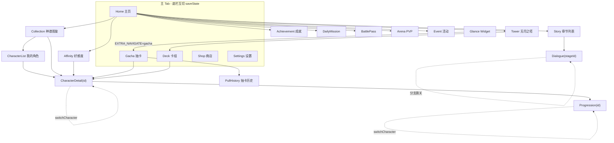

# F1 — 导航架构与完整路由图

## Claims

1. **Claim**: 导航使用 Navigation Compose 2.9 类型安全路由（`@Serializable` data class/object + `composable<Route>()`），无字符串路由、无自定义 `NavType`。
   · Evidence: `MilanKotlin/app/src/main/java/com/milan/game/ui/nav/Routes.kt:1-13`；`MilanNavHost.kt:40-43`（`NavHost` / `composable` / `toRoute`）
   · Confidence: **high**

2. **Claim**: 单 `NavHost` 扁平图（无嵌套 `navigation { }` 子图），19 个目的地全部挂在同一 graph 下；`startDestination = HomeRoute`。
   · Evidence: `MilanNavHost.kt:151-160`（NavHost + startDestination）；全文无 `navigation(` 嵌套块
   · Confidence: **high**

3. **Claim**: 底部导航 5 tab（Home/Gacha/Deck/Shop/Settings）不是全局 Scaffold chrome——`GameNavBar` 由 5 个 tab Screen **各自自行渲染**，子页压栈后自然盖住 tab（无 Scaffold bottomBar）。
   · Evidence: `Routes.kt:9`；`MainActivity.kt:14-15`；`HomeScreen.kt:204-208`、`DeckScreen.kt:189-193`、`GachaScreen.kt:446`、`ShopScreen.kt:133`、`SettingsScreen.kt:298`
   · Confidence: **high**

4. **Claim**: 切 tab 走标准 bottom-nav 模式：`popUpTo(start) { saveState=true }` + `launchSingleTop` + `restoreState`，各 tab 状态互不丢。
   · Evidence: `MilanNavHost.kt:110-117`（`navigateToTab`）
   · Confidence: **high**

5. **Claim**: 子页一律 `navController.navigate(Route)` 压栈，返回统一 `popBackStack()`；系统 Predictive Back 由 Navigation 自动接入，无手写 BackHandler。
   · Evidence: `Routes.kt:10-11`；`MilanNavHost.kt` 各 `onBack = { navController.popBackStack() }`；全文无 `BackHandler`
   · Confidence: **high**

6. **Claim**: 立绘共享元素过渡：`SharedTransitionLayout` 包 `NavHost`，scope 经自建 `LocalSharedTransitionScope` 注入；`composable` 的 `AnimatedContentScope` 作为 `animatedVisibilityScope` 传给 Deck/Collection/CharacterList/CharacterDetail；列表卡片与详情用同 key `sharedBounds`。
   · Evidence: `MilanNavHost.kt:146-150`；`SharedTransitionLocals.kt:15`；`CharacterDetailScreen.kt:147-153`；`CharacterCard.kt:73-78`
   · Confidence: **high**

7. **Claim**: 页面转场两套：子页右进左出（推）/左进右出（退），tab 交叉淡入淡出+微缩；Predictive Back 兼容靠 pop 转场定义。
   · Evidence: `InkTransitions.kt:18-47`；`MilanNavHost.kt:156-159`（NavHost 全局默认）+ tab 目的地覆盖 `tabEnter/tabExit`
   · Confidence: **high**

8. **Claim**: 唯一「深链」是 Glance 桌面小组件经 Intent extra `milan.navigate=gacha`，`MainActivity` 读后传 `openGachaOnStart`，`LaunchedEffect` 在 ready 后 `navigateToTab(Gacha)`；**不是** Navigation `navDeepLink`，manifest 无 URI deep link intent-filter。
   · Evidence: `MainActivity.kt:24-40`；`GachaGlanceWidget.kt:50-55`；`MilanNavHost.kt:119-122`；`AndroidManifest.xml` 仅有 LAUNCHER/RECEIVER
   · Confidence: **high**

9. **Claim**: 角色左右切换（Detail/Progression 内）用 `popUpTo(current) { inclusive=true }` 替换当前 entry，避免返回栈累积。
   · Evidence: `MilanNavHost.kt:129-138`（`switchCharacter`）
   · Confidence: **high**

10. **Claim**: `TabRoute` sealed interface 收口 `NavItem.toNavRoute()` 返回类型，编译期保证 tab↔路由映射不漏、不塞子页进底栏；`RoutesTest` 覆盖映射唯一性与序列化往返。
    · Evidence: `Routes.kt:20,92-98`；`RoutesTest.kt:25-71`
    · Confidence: **high**

11. **Claim**: 启动门控：`GameState.failure != null` → 错误页（可重试）；`!ready` → 骨架屏；就绪前 NavHost 不组合。就绪后才有路由。
    · Evidence: `MilanNavHost.kt:82-106`
    · Confidence: **high**

12. **Claim**: 顶栏 `AppTopBar`（返回箭头 48dp + 标题 + 可选 `ResourceBar`）由子页各自使用，非全局 Scaffold topBar；标题有水墨 alpha 呼吸动画。
    · Evidence: `AppChrome.kt:57-133`
    · Confidence: **high**

13. **Claim**: 全局 Snackbar 宿主挂在 NavHost 外层 Box（`LocalFeedback`），位于底部导航之上（padding bottom 84dp）。
    · Evidence: `MilanNavHost.kt:142-144, 341-352`；`Feedback.kt:25-27`
    · Confidence: **high**

14. **Claim**: PvE 副本路由与 composable 已删除（2026-09-06 S2）；历史注释保留。
    · Evidence: `Routes.kt:85`；`MilanNavHost.kt:331`
    · Confidence: **high**

---

## Complete route inventory

共 **19** 个 `@Serializable` 路由（5 TabRoute + 14 子页）。

### 主 tab（`sealed interface TabRoute`）

| Route | 参数 | Screen composable | 入口 |
|-------|------|-------------------|------|
| `HomeRoute` | — | `HomeScreen` | startDestination；底栏 Home；`onOpenGacha` 等回调 |
| `GachaRoute` | — | `GachaScreen` | 底栏 Gacha；Home `onOpenGacha`；Glance widget Intent extra |
| `DeckRoute` | — | `DeckScreen` | 底栏 Deck；Tower `onOpenDeck` |
| `ShopRoute` | — | `ShopScreen` | 底栏 Shop |
| `SettingsRoute` | — | `SettingsScreen` | 底栏 Settings |

切 tab 统一走 `navigateToTab`（saveState/restoreState）。

### 子页（压栈盖住 tab，顶栏/系统返回 pop）

| Route | 参数 | Screen composable | 入口（谁 navigate） |
|-------|------|-------------------|---------------------|
| `CollectionRoute` | — | `CollectionScreen` | Home `onOpenCollection` |
| `CharacterListRoute` | — | `CharacterListScreen` | Collection `onOpenMyCharacters` |
| `CharacterDetailRoute` | `characterId: String` | `CharacterDetailScreen` | `openCharacter(id)`：Home / Gacha / Deck / Collection / CharacterList / Affinity 的角色卡 |
| `ProgressionRoute` | `characterId: String` | `ProgressionScreen` | Detail `onOpenProgression`；`switchCharacter` 替换 |
| `TowerRoute` | — | `TowerScreen` | Home `onOpenTower`；内有 `onOpenDeck` 切 Deck tab |
| `AchievementRoute` | — | `AchievementScreen` | Home `onOpenAchievements` |
| `PullHistoryRoute` | — | `PullHistoryScreen` | Gacha `onOpenHistory` |
| `StoryRoute` | — | `StoryScreen` | Home `onOpenStory` |
| `DialogueRoute` | `stageId: String` | `DialogueScreen`（经 StoryViewModel 查 stage；悬空 id 兜底 pop） | Story `onOpenStage`；分支 `onNavigateStage` 再压目标关 |
| `DailyMissionRoute` | — | `DailyMissionScreen` | Home `onOpenDailyMissions` |
| `BattlePassRoute` | — | `BattlePassScreen` | Home `onOpenBattlePass` |
| `AffinityRoute` | — | `AffinityScreen` | Home `onOpenAffinity`；内可 `openCharacter` |
| `ArenaRoute` | — | `ArenaScreen` | Home `onOpenArena` |
| `EventRoute` | — | `EventScreen` | Home `onOpenEvent` |

### 已删除

- ~~`PvERoute`~~ — 2026-09-06 S2 随 PvEService 裁撤。

### 参数类型

- 全部为 `String`（`characterId` / `stageId`）。
- **无** 自定义 `NavType`、**无** nullable 参数、**无** 嵌套 navigation graph、**无** `navDeepLink`。

---

## Navigation chrome

### 底部导航 `GameNavBar`

- `NavItem` 枚举 5 项：`Home(主页/Home)` · `Gacha(抽卡/Star)` · `Deck(卡组/List)` · `Shop(商店/ShoppingCart)` · `Settings(设置/Settings)`（`GameNavBar.kt:53-59`）。
- 视觉：玄墨玻璃底座渐变 + 金箔选中面板 + 顶部金线宽度 spring 弹射 + 按压 0.94 缩放 + 选中 0.92→1.0 弹跳。
- 无障碍：`Role.Tab` + `SemanticsProperties.Selected`。
- **挂载方式**：5 个 tab Screen 末尾各自 `GameNavBar(active = NavItem.Xxx, onSelect = onNav)`，`onNav` 即 `::navigateToTab`。子页无底栏。

### 顶栏 `AppTopBar`

- 返回「‹」48dp 热区 + `contentDescription="返回"`；标题 `AnimatedContent` 横滑淡入 + 水墨 alpha 0.84~1.0 呼吸（3s 正弦）。
- 可选 `ResourceBar`（✦ 星尘 / ◆ 钻石），订阅 `AppGraph.service.economy` StateFlow，数值 400ms 滚动。
- 子页各自调用；主页不需要。

### Predictive Back

- 由 Navigation Compose 自动接入（类型安全路由 + `popBackStack`）；`InkTransitions` 的 popEnter/popExit 提供兼容转场（左进右出）。无手写 `BackHandler`。

### SharedTransitionLayout

- `MilanNavHost` 内：`SharedTransitionLayout { CompositionLocalProvider(LocalSharedTransitionScope provides this) { NavHost(...) } }`。
- Compose 1.11 官方 `LocalSharedTransitionScope` 已移除，故自建 nullable CompositionLocal，深层子项 null 安全降级为普通渲染。
- 共享 key：`"portrait_${characterId}"`，在 `CharacterCard` 与 `CharacterDetailScreen` 配对使用 `sharedBounds`。
- 传入 `animatedVisibilityScope = this` 的目的地：DeckRoute、CollectionRoute、CharacterListRoute、CharacterDetailRoute。

### 转场 `InkTransitions`

| 用途 | 组合 | 时长 |
|------|------|------|
| 子页进 | slideFromRight(it/3) + fadeIn + scaleIn 0.97 | 200ms |
| 子页出 | slideOutToLeft(-it/3) + fadeOut | 150ms |
| 返回进 | slideFromLeft(-it/3) + fadeIn | 150ms |
| 返回出 | slideOutToRight(it/3) + fadeOut | 200ms |
| Tab 进 | fadeIn + scaleIn 0.97 | 180ms |
| Tab 出 | fadeOut | 180ms |

Tab 目的地在 `composable<HomeRoute|GachaRoute|...>` 上覆盖为 `tabEnter/tabExit`；子页用 NavHost 全局默认。

### 反馈层

- `LocalFeedback` + `SnackbarHost` 挂在 NavHost 外 `Box`，`padding(bottom = 84.dp)` 避开底栏。

### 启动门控

- `failure != null` → `InkErrorScreen`（原因 + 重试走完整 `ensureInitialized`）。
- `!ready` → `InkSkeleton` 全屏骨架。
- 就绪后才组合 `SharedTransitionLayout + NavHost`。

---

## Diagram-ready summary

树形语义：5 tab 平级（底栏切换）；子页一律压栈覆盖 tab；角色链最深 4 层（Home/Collection → CharacterList → Detail → Progression）；Dialogue 可自环跳关。

---

## Open gaps

1. **Screen 内部二级导航**：部分 Screen（如 Settings、Arena、Story）是否内嵌自定义 tab/分段切换未逐文件展开——本 F1 只覆盖 `MilanNavHost` 的 Nav 图。
2. **`DialogueRoute(stageId)` 悬空引用兜底**逻辑依赖 `StoryViewModel.findStage`；内容侧 stage id 约定未在本角度核实。
3. **Predictive Back 系统级手势**：代码侧未见显式配置（默认由 Navigation/Activity 接入）；真机手势表现未验证。
4. **`sharedBounds` key 是否还有第三处使用**：已确认 CharacterCard + CharacterDetail；Home Hero 等处是否也参与共享元素未逐点核实。
5. **RoutesTest 覆盖范围**：只测了 5 tab 映射 + CharacterDetail/Progression 序列化 + 7 个 data object；后续新增的 Tower/Achievement/Story 等 data object 未纳入该测试文件（不影响生产路由正确性）。
6. **manifest 无 URI deep link**：仅确认无 `navDeepLink` 与 URI intent-filter；若未来加 App Links 需新开。
