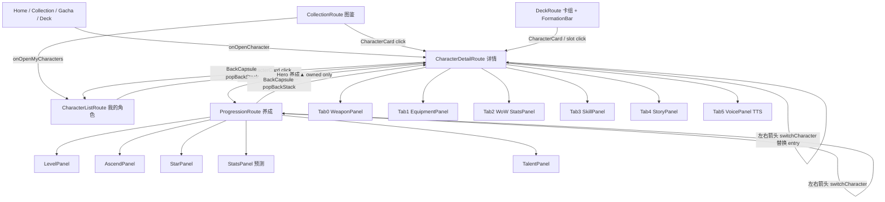

# F3 — 角色链路 UI

覆盖「列表 → 详情 → 养成」全链路及装备/属性/武器/信息面板。路径根：`MilanKotlin/app/src/main/java/com/milan/game/`。

---

## 1. CharacterListScreen — 我的角色列表

**目的**：已拥有角色的图鉴式名录；展示收集完成度、支持筛选/排序，点击进详情。

**布局**（`ui/characters/CharacterListScreen.kt:61-182`）
- 顶部 `AppTopBar(title = "我 的 角 色")`（L99）
- 拥有计数文案「已拥有 N 位角色 / 已显示 x / 已拥有 N」（L102-108）
- `CompletionPanel`（L188-236）：图鉴收集进度条（Gold `LinearProgressIndicator`）+ 分稀有度 owned/total 徽标（UR→R 倒序，`AppTheme.rarityColor`）
- `ListFilterBar`（L114-125，实现在 `ui/components/ListFilterBar.kt`）：搜索框 + 稀有度 chips + 元素 chips + 排序 chips（`ListSortMode`：RarityDesc / NameAsc / WorldAsc / ElementAsc）
- 空态：`EmptyState`——未拥有「还没有角色 / 去寻访」，筛选空「没有符合条件的角色 / 试试调整筛选条件」（L128-136）
- 网格：`LazyVerticalGrid(GridCells.Fixed(2))`（L138-178），key=`characterId`，`animateItem()` + 滚动视差 `translationY = parallax * 8f`（L146-175）

**交互流**
- 进入：Home/Collection → `CharacterListRoute`（图鉴页「我的角色」入口 `onOpenMyCharacters`，`ui/nav/MilanNavHost.kt:220`）
- 点卡：`onOpenCharacter(ch.save.characterId)` → `openCharacter()` navigate `CharacterDetailRoute`（NavHost L124-127）
- 返回：`AppTopBar.onBack` → `popBackStack()`
- 筛选状态：`rememberSaveable`（searchText / rarityFilter / elementFilter / sort，L76-79），离开再回不丢

**共享元素过渡**
- 卡片经 `CharacterCard` 内 `sharedBounds(key = "portrait_$characterId")`（`CharacterCard.kt:74-81`）；Screen 传入 `animatedVisibilityScope = this`（NavHost composable scope）

**稀有度/元素视觉编码**
- 稀有度：`AppTheme.rarityColor` R=松烟 / SR=石青 / SSR=朱砂 / UR=金箔（`AppTheme.kt:115-121`）
- 元素：`ElementTheme.forElement` 8 系（`ElementTheme.kt:32-42`）；列表元素候选集来自已拥有角色去重（L81）

**关键状态与 ViewModel**
- `CharacterListViewModel`（`CharacterListViewModel.kt:32-61`）：构造注入 `GameService`（`AppGraph.factory`，L70）
- `CharacterListUiState(owned, ownedCount, ownedIds)`；`roster = service.characters` 静态内容；订阅 `service.snapshot` 刷新 owned/ownedIds
- `owned` 口径：`saveData.ownedCharacters.mapNotNull { service.ownedView(it) }`（天赋注入）

**file:line 锚点**
- Screen：`ui/characters/CharacterListScreen.kt:61`
- CompletionPanel：同文件 `:188`
- VM：`ui/characters/CharacterListViewModel.kt:32`
- 卡片：`ui/components/CharacterCard.kt:59`

---

## 2. CharacterDetailScreen — 角色详情

**目的**：单角色全息详情；立绘 Hero + 六 Tab 面板（武器/装备/属性/技能/故事/语音）；未拥有可浏览（剪影/暗遮罩）。

**布局**（`ui/characters/CharacterDetailScreen.kt:81-315`）
- Hero：`SubPageHero`（`ui/components/PageComponents.kt:83-167`），高度 = 屏高 56%（L142-144）
  - 立绘铺满 + 底部墨色渐隐（fadeHeight 150.dp）+ 未拥有「🔒 未获得」暗遮罩
  - `HeroNameplate`：稀有度徽章 + 名字 27sp + 元素圆标 + 称号（PageComponents L196-262）
  - 悬浮操作：左上 `BackCapsule`、两侧 `GlassArrow` 左右切角色、右上「养 成 ▲」（仅 owned）
- Tab 栏：6 标签均分（`detailTabs = ["武器","装备","属性","技能","故事","语音"]`，L69），金箔滑动指示器 + 选中底色 Gold α18%（L209-256）
- 面板：`AnimatedContent` 横向滑入/淡出（L261-309）
  - 0 武器 `WeaponPanel`（无 weapon 则「暂无专属武器」）
  - 1 装备 `EquipmentPanel`
  - 2 属性 `StatsPanel`（WoW 风格，见 §4）
  - 3 技能 `SkillPanel`
  - 4 故事 `StoryPanel`
  - 5 语音 `VoicePanel`

**交互流**
- 进入：任意 tab / 列表 / 图鉴 / 抽卡 / 主页快捷 → `openCharacter(id)` 压栈
- 左右切角色：`switch(delta)` 在全表 `characterIds` 环移（含未拥有，L135-140）；NavHost `switchCharacter` 用 `popUpTo(current) inclusive + launchSingleTop` 替换 entry，不堆返回栈（`MilanNavHost.kt:129-138`）
- 进养成：Hero 右上「养 成」→ `onOpenProgression(id)` → `ProgressionRoute`（NavHost L236-238）
- 返回：`popBackStack()`；`def == null` 时 `MissingCharacter` 空态 + 返回（L101-105）

**共享元素过渡**
- `sharedBounds(key = "portrait_${characterId}", resizeMode = RemeasureToBounds)`（L148-157）
- scope 来源：`LocalSharedTransitionScope`（`ui/SharedTransitionLocals.kt:15`），MainActivity 在 `SharedTransitionLayout` content 注入（Compose 1.11 官方 Local 已移除，自建 CompositionLocal + null 安全降级）
- 滚动视差：`scrollState.value * 0.3f` 驱动 `portraitModifier.graphicsLayer { translationY }`（L159-164）
- 入场：alpha 0→1 400ms + scale 0.95→1 spring（L169-181）

**稀有度/元素视觉编码**
- `rarityCol = AppTheme.rarityColor`；`ElementTheme.forElement` → eFrom/eGlyph；世界色 `WorldTheme.forWorld`（技能/故事/语音面板文字色）

**关键状态与 ViewModel**
- `CharacterDetailViewModel`（`CharacterDetailViewModel.kt:45-154`），按 `characterId` 建 VM（`viewModel(key = characterId, factory = AppGraph.characterDetailFactory)`，L93-96）
- `CharacterDetailUiState(def, save, owned, characterIds, equippedSlots, bag)`
  - 未拥有兜底 save：`CharacterSaveState(level=1, stage=1, stars=1)`
  - 装备槽视图：`EquippedSlotView`；背包：`BagEquipView`（含 `preferredSlot` / `canEquip`）
- 写动作：`equip` / `unequip` / `enhance` / `dismantle` → `GameService`，`WriteOutcome`/`Equipment*Outcome` → `_toasts` Channel → `LocalFeedback` Snackbar
- 防重入：`busy` StateFlow + `launchWrite`（L141-153）
- 属性推导留 Screen：`remember(def, characterId, level, stage, stars, talentPoints.size) { CharacterStats.compute(view) }` + `computeAt(..., stars=1)` 基线（L125-131，M3 稳定 key 修复）
- 语音：`DisposableEffect` 离开时 `SpeechPlayer.stop()`（L108-110）

**file:line 锚点**
- Screen：`ui/characters/CharacterDetailScreen.kt:81`
- VM：`ui/characters/CharacterDetailViewModel.kt:45`
- Hero：`ui/components/PageComponents.kt:83`
- 工厂：`ui/di/AppGraph.kt:86-87`

---

## 3. WeaponPanel — 武器面板

**目的**：展示角色专属武器概念图 + 名称 + 稀有度专属标签 + lore 描述。

**布局**（`ui/characters/WeaponPanel.kt:52-135`）
- `GlassPanel(highlighted = owned)`
- `WeaponStage`（L149-213）：160.dp 高圆角暗底 `AppTheme.WeaponStageBg` + 元素径向晕染（eFrom α75→0）+ 稀有度描边 α200
  - 图源：`assets/weapons/{weaponVfx}.webp`，IO 线程 `inSampleSize=2` 解码 + `LruCache(8)`（L142、L158-168）
  - key 变化先置 null，防切角色闪上一张图（P1-2）
  - 缺失回退居中武器名（Canvas 几何绘制为 P2 未做）
- 下方：元素圆标 + 武器名 18sp Gold 阴影 + 「UR/SSR/SR/R 专属」动态标签（L98-114）+ weaponDesc

**交互流**：详情 Tab 0；无写操作，纯展示。

**视觉编码**：稀有度描边 + 专属标签底色；元素晕染与元素圆标同色。

**file:line**：`ui/characters/WeaponPanel.kt:52`（入口）/ `:149`（舞台）

---

## 4. WoWStatsPanel — 属性面板（详情 Tab 2）

**目的**：魔兽世界风格角色属性框——主属性四维 + 次级属性 + 等级/星级/天赋点页脚；展示「当前 vs 基线」加成。

**布局**（`ui/characters/WoWStatsPanel.kt:58-138`）
- 暗色渐变底（`WoWPanelTop/Bottom`）+ 金色双描边 + 四角菱形饰钉 Canvas（L122-136，C# WoWStatsFrame）
- 「主 属 性」：攻/防/命/速 → `UnitStats.atk/def/hp/spd`，bonus = cur − base（L79-88）
- 「次 级 属性」：暴/急/甲/挡 → `StatsCalculator.deriveSecondary`（L97-108）
- 每行：`StatBadge` 圆形中文单字 + 中英名 + 等宽数值（tnum）+ ↑绿/↓红加成 + 入场填充条（延迟 index×80ms spring，L154-218）
- 页脚：`等级 Lv.x · 星级 ★… · 天赋点 n · 未拥有?`（L113-119）

**交互流**：详情 Tab 2，只读。基线 `baseStats = CharacterStats.computeAt(view, 1, stage, stars=1)`（DetailScreen L129-131）。

**file:line**：`ui/characters/WoWStatsPanel.kt:58`

---

## 5. EquipmentPanel — 装备面板（C3）

**目的**：5 槽位穿脱 + 背包未装备列表 + 强化/分解。

**布局**（`ui/characters/EquipmentPanel.kt:51-119`）
- 「穿戴槽位」：weapon / head / body / accessory1 / accessory2（`slotLabel` L30-37）
  - `SlotRow`：槽位名 + 稀有度色装备名 + `+level · mainStat` + ActionChip「强化」「卸下」
  - 未拥有：「尚未拥有该角色，无法穿戴装备。」
- 「背包装备（n）」：`BagRow` 含副词条数 +「穿戴」「强化」「分解」（danger 色）
  - 空背包提示爬塔来源
- `ActionChip`：Gold α14 底 / danger Text3 α12 底（L230-242）

**交互流**
- 穿戴：`preferredSlotForType`（L245-258）类型→槽位映射；饰品优先进空槽；匹配失败 Snackbar「无法匹配槽位」
- 回调：`onEquip/onUnequip/onEnhance/onDismantle` → DetailVM → GameService；结果 toast

**视觉编码**：装备名色 = `AppTheme.rarityColor(rarity)`；稀有度文案 rarityLabel UR/SSR/SR/R。

**关键状态**：VM 派生 `EquippedSlotView` / `BagEquipView`，Panel 不依赖 service/templates。

**file:line**：`ui/characters/EquipmentPanel.kt:51`；槽位偏好 `:245`

---

## 6. InfoPanels — 技能 / 故事 / 语音

**SkillPanel**（`InfoPanels.kt:40-85`）
- `GlassPanel` 内逐条：`[Ultimate|Active|Passive]` 类型标签（Ultimate=Warning 色 / Active=技能元素色）+ displayName + description
- 文字色走 `WorldPalette`

**StoryPanel**（`:88-164`）
- 题记 lore：3.dp 金箔竖条 + 淡墨引言
- 三段式故事：`parseStorySections` 按 `\n\n` + `：` 解析（`:207-220`）→ 本源(Gold)/执念(SealRed)/羁绊(Frost) 彩色竖条小标题
- 所属势力徽标（faction，世界 glow 色 chip）

**VoicePanel**（`:223-268`）
- 逐条「▸ 台词 … ▶」；▶ 点击 `SpeechPlayer.speak(context, v)` TTS
- 空列表「暂无语音」

**file:line**：`ui/characters/InfoPanels.kt:40 / :88 / :223`

---

## 7. ProgressionScreen — 角色养成

**目的**：等级/突破/升星/属性预测/天赋树五合一养成页；写操作全经 VM。

**布局**（`ui/progression/ProgressionScreen.kt:43-207`）
- Hero `SubPageHero`（高度 46% 屏高，L94-96）：返回 / 左右切角色；**无**「养成」入口、无 sharedBounds（详情→养成无立绘 shared transition）
- 视差：`scrollProgress` 驱动 `translationY * 120f` + `alpha 1−0.15*progress`（L120-123）
- `ResourceBar`（`ProgressionPanels.kt:58-79`）：✦ 星尘 + ❖ 星魂碎片（`EconomySlice`）
- 五段 `SectionTitle` + `EntranceItem` 错落入场：
  1. **等级与经验** `LevelPanel`（Panels L99-191）：Lv.n / cap、EXP 进度条（600ms 金填充 + 前沿光效）、升级 ×1 / ×5 / 升满
  2. **突破** `AscendPanel`（L231-281）：阶段 n/max、所需碎片+星尘、「突 破」
  3. **升星** `StarPanel`（L286-336）：★☆ 星串（Stars=0 不画实心星铁律）、所需碎片、「升 星」
  4. **属性** `StatsPanel`（L360-433）：攻防命速当前值 + 「Lv+1 / 突破 / 升星」青字预测；M4 按养成度键 `remember` 四次 `computeStats` 推导
  5. **天赋** `TalentPanel`（L438-506）：天赋点数 + 三分支（强攻 Danger / 坚壁 Frost / 灵动 Violet）+ 节点（已点✓ / 可点 / 锁定暗框）

**交互流**
- 进入：详情 Hero「养 成 ▲」→ `ProgressionRoute(id)` launchSingleTop
- 左右切角色：同详情 `switchCharacter`（替换当前 Progression entry）
- 返回：`popBackStack()`；`def==null` → `MissingCharacter`

**共享元素**：无（Progression 侧未挂 `portrait_$id` sharedBounds；仅滚动视差）

**关键状态与 ViewModel**
- `ProgressionViewModel`（`ui/progression/ProgressionViewModel.kt:58-174`），按 characterId 建 VM（AppGraph.progressionFactory）
- `ProgressionUiState(def, save, owned, characterIds)` + `economy: StateFlow<EconomySlice>` + `busy` + `toasts`
- 实现 `ProgressionQueries` 接口：maxLevelForStage / levelCost / expProgress / ascendFragments / ascendSoft / starUpFragments / talentTree / canAllocateTalent / computeStats(At) —— 纯面板不摸 service
- 写操作 `runWrite`：未拥有守卫 + busy 防重入（I13）+ Rejected 细分 toast（已满级/星尘不足/碎片不足/已满星/天赋点不足）
- `levelUp(n)` / `ascend()` / `starUp()` / `allocateTalent(nodeId)`

**file:line**
- Screen：`ui/progression/ProgressionScreen.kt:43`
- Panels：`ui/progression/ProgressionPanels.kt:58`（ResourceBar）起
- VM：`ui/progression/ProgressionViewModel.kt:58`

---

## 8. CharacterCard — 共享角色卡（列表/卡组/图鉴）

**目的**：实体 TCG 卡面（CodexCard 外壳），三处复用：CharacterList / Deck / Collection。

**布局**（`ui/components/CharacterCard.kt:59-223`）
```
CodexCard(tier=rarity) 纸厚 + 工艺框
 顶栏：RarityChip + ElementDot
 画心窗：aspectRatio(CardMetrics.Aspect) + 金线内衬
   AuraHalo + PortraitImage(Full, aura, glowScale 0.65) + 底衬渐变
   locked → 黑遮罩 + Lock 图标
 鎏金分隔
 铭牌：name / title / rarity 点×rarity + rarityName / footer?
```
- Deck 列表 footer 传星级 `★★★`；Collection 传未获得/星级 footer

**共享元素**：`sharedBounds(key = "portrait_$characterId")`（L74-81），与详情 Hero 配对。

**CodexCard 工艺**（`CodexCard.kt:55+`）：UR 流光/SSR 金边/SR 双线/R 素线，色纹光动四维冗余，取色只认 `AppTheme.rarityColor/Glow/Gradient`。

**file:line**：`ui/components/CharacterCard.kt:59`；外壳 `ui/components/CodexCard.kt:55`

---

## 9. CharacterStats — 属性推导适配器

**目的**：详情/养成/爬塔预览的展示口径属性计算（与战斗 `ServiceCore.unitStatsFor` 不同：不含装备加成）。

**实现**（`ui/stats/CharacterStats.kt:21-71`）
- 纯 object，复用无状态 `ProgressionEngine` + `TalentEngine`
- `compute(view)` = `computeAt(view, save.level, max(1, stage))`
- `computeAt(view, level, stage, stars=-1)`：
  - 天赋分支/已点节点/节点效果从 `view.talent` 读取（构造注入，不回查 GameState）
  - 调 `StatsCalculator.compute(baseStats, level, stage, stars, branchIds, allocatedNodes, nodeEffectsMap)`
  - def==null → 空 UnitStats(hp=1)

**file:line**：`ui/stats/CharacterStats.kt:21`

---

## 10. FormationUi — 编队（从 Deck 进入，与角色链路交汇）

**目的**：出战编队槽位条 + 共鸣文案；DeckScreen / TowerScreen 共用，**不是**从角色详情进入，但复用 `PortraitImage` 与稀有度描边，形成角色视觉语言第三处。

**布局**（`ui/components/FormationUi.kt:59-153`）
- 标题「出战编队」+ `n/maxSlots`
- N 个 aspectRatio(0.74) 槽：已入队 = 元素渐变底 + Avatar 立绘 + 底部铭牌（元素字+名）；空槽「＋」
- `formationResonanceLabel`：同调共鸣全员攻/速 或 双星共鸣×pairs 攻击（数值取 `TeamResonance` 常量）

**交互流**：Deck 内点槽位回调 characterId（空槽 null）；点卡片走 `onOpenCharacter` → 详情。

**file:line**：`ui/components/FormationsUi.kt` → 实为 `ui/components/FormationUi.kt:59`

---

## 11. PortraitImage / SubPageHero 支撑

| 组件 | 文件:行 | 角色链路职责 |
|------|---------|--------------|
| `PortraitImage` | `ui/components/PortraitImage.kt:52` | getIdentifier 探测 → IO 解码（Full=2x / Avatar 裁脸）→ Crossfade；缺图稀有度渐变+首字占位；可选 AuraHalo |
| `SubPageHero` | `ui/components/PageComponents.kt:83` | 详情/养成共用 Hero：立绘+渐隐+铭牌+返回/箭头/养成钮 |
| `MissingCharacter` | `PageComponents.kt:45` | def 为空空态 |
| `ListFilterBar` | `ui/components/ListFilterBar.kt:52` | 筛选投影 `ListFilter.filterSort` 纯函数 |
| `OwnedCharacterView` | `GameState.kt:146` | save×def×talent 合并视图；`GameService.ownedView` 统一构造（L164） |

---

## User journey map



**路径要点**
1. **列表→详情**：唯一挂 sharedBounds 的一对（key=`portrait_{id}`）；列表网格 2 列 TCG 卡。
2. **详情→养成**：仅 owned 显示入口；无 shared transition，仅 Ink 滑入 + Hero 滚动视差。
3. **左右切角色**：`switchCharacter` 用 `popUpTo(inclusive)` 替换当前详情/养成 entry，返回栈保持「上级→当前角色」单层。
4. **写操作回流**：VM 订阅 `service.snapshot` → 面板自动刷新；toast 走 `LocalFeedback`。

---

## Open gaps

1. **详情→养成无 sharedElement**：两页都渲染 `SubPageHero` 立绘，但 Progression 侧未挂 `portrait_$id` sharedBounds，跳转立绘会硬切；若要一致体验需在 Progression 接 `animatedVisibilityScope` + LocalSharedTransitionScope。
2. **P2 未迁移能力**（DetailScreen L77-79 注释）：视差 3D 立绘、武器舞台帧动画（C# WeaponPreviewView）、错落入场 Motion.PlayEntrance、ProgressionChanged 就地刷新——当前仅静态帧 + 快照驱动。
3. **装备面板无独立装备详情页**：主词条/副词条仅摘要一行，无法展开查看全部 subStats 或对比。
4. **列表无「未拥有」剪影入口**：CharacterList 只列 owned；全图鉴浏览在 CollectionScreen（locked 卡）；两者筛选条复用但数据源分裂。
5. **Tab 状态不持久**：`selectedTab` 用 `remember` 而非 `rememberSaveable`，进程重建回 Tab0。
6. **FormationBar 与 CharacterCard 无 sharedElement**：编队缩略与详情立绘不同 key，进详情无连续动画。
7. **VoicePanel TTS 与详情离开停播**：详情 `onDispose { SpeechPlayer.stop() }`，但从语音 Tab 直接进养成时养成页无对应清理（语音已在详情 dispose 时停，风险低）。
8. **属性口径双轨**：`CharacterStats`（展示，不含装备）vs `ServiceCore.unitStatsFor`（战斗，含装备）——详情属性面板不含装备加成，易与实际战力不一致，文档已注明但 UI 无提示。
